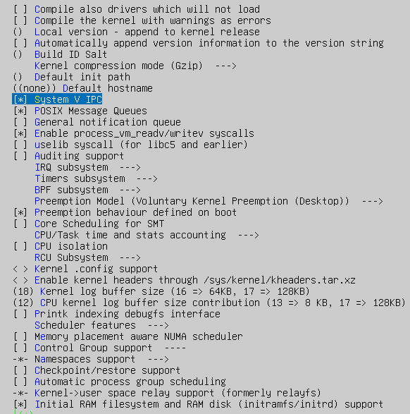
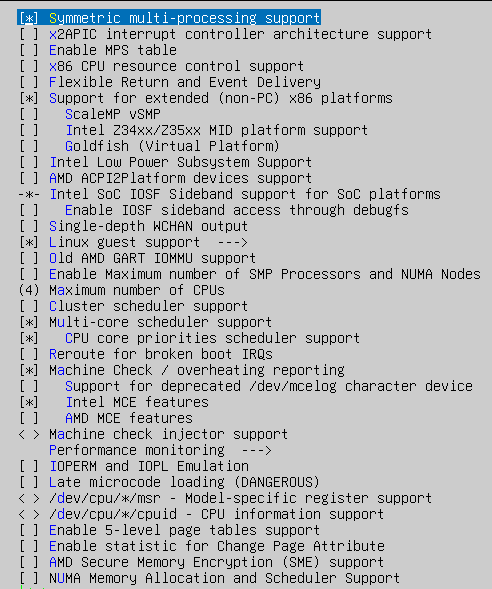
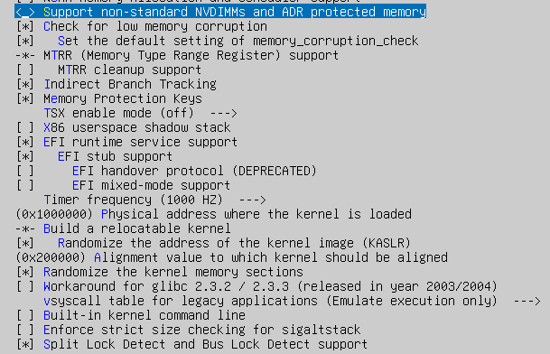
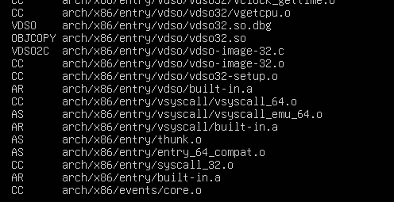
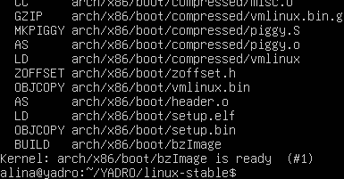
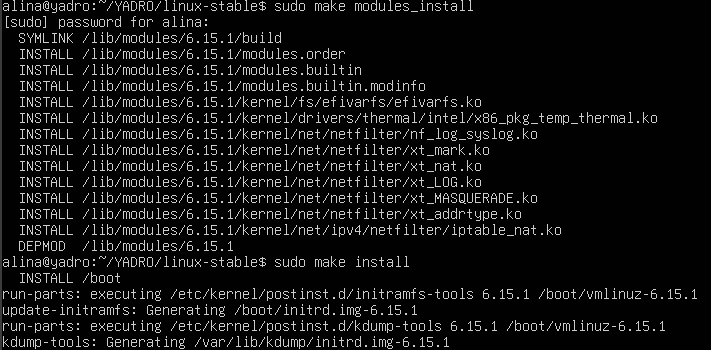
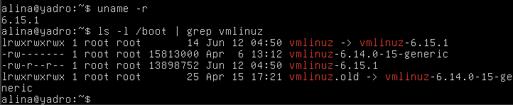
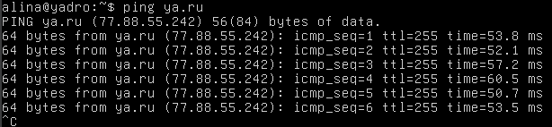

### Сборка и установка ядра Linux
#### 1. Установка необходимых утилит и библиотек
Перед сборкой ядра необходимо установить весь необходимый набор инструментов, включая компилятор, библиотеки и утилиты для конфигурации:
```bash
sudo apt update
sudo apt install build-essential libncurses-dev bison flex 
sudo apt install libssl-dev bc libelf-dev git
```

#### 2. Получение исходных кодов ядра

Исходный код ядра можно получить со специального репозитория. Я использовала ветку с меткой `v6.15.1` и создала собственную ветку `mykernel`:
```bash
git clone https://git.kernel.org/pub/scm/linux/kernel/git/stable/linux.git
cd linux-stable
git checkout -b mykernel v6.15.1
```

#### 3. Создание и настройка конфигурации
Далее необходимо создать дефолтную конфигурацию, которую позже будем изменять с помощью специального меню:
```bash
make defconfig
```
Эта команда создаёт базовый конфигурационный файл `.config`, который можно затем изменить через специальное интерактивное меню.

Чтобы настроить ядро под свои задачи, я открыла текстовое меню конфигурации:
```bash
make menuconfig
```

##### Настройки в **General Setup**:


Изменения: были отключены такие опции как поддержка аудита и initramfs, чтобы не загружать ядро устаревшим и ненужным функционалом.

##### Настройки в **Processor type and features**:




Изменения: были включены опции, связанные с архитектурой x86_64, поддержкой многопроцессорности и загрузкой через EFI. Я оставила выключенными экспериментальные или устаревшие платформы.

Остальные параметры ядра оставлены по умолчанию для минимального, но работоспособного окружения.

#### 4. Сборка ядра
Далее, после настройки конфигурации надо ее скомпилировать:
```bash
make -j 4
```
Флаг `-j 4` используется для ускорения сборки с помощью 4-х потоков.

 После этого начинается компиляция ядра:
 
Ядро скомпилировалось:
 
Теперь в папке arch/x86/boot появился  файл bzImage - сжатое ядро для архитектуры x86.

#### 5. Установка модулей и ядра
Затем необходимо выполнить команды для сборки и установки модулей ядра:
```bash
make modules
```

```bash
make modules_install
```

Чтобы установить ядро, необходимо выполнить команду, которая компилирует ядро vmlinuz-\* и другие служебные файлы, а также добавляет запись о новом ядре в загрузчик grub:
```bash
make install
```


Скомпилированное и установленное ядро появилось в списке ядер в папке boot:


#### 6. Загрузка в новое ядро
После установки ядра необходимо перезагрузить систему, чтобы войти в grub:
```bash
sudo reboot
```
Далее, во время загрузки системы надо нажать клавишу Shift, чтобы зайти в меню grub, после этого попадаем в терминал с уже новым, только что скомпилированным ядром.

С помощью uname -r узнаем имя ядра, которое сейчас установлено, а с помощью второй команды узнаем  какое имя получило  ядро, которое было нами скомпилировано.

Система является работоспособной, например работает отправка сообщений до определенного адреса сети, что представлено ниже.
