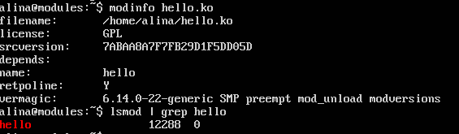
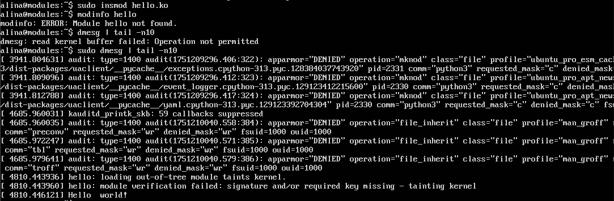
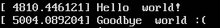
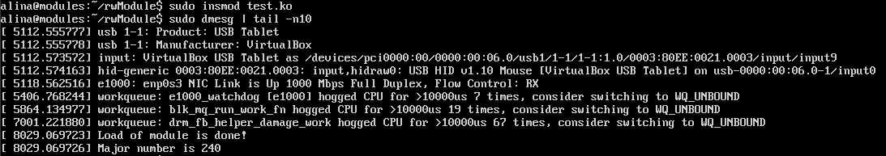
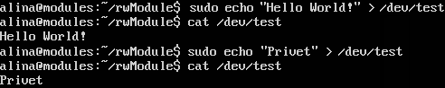
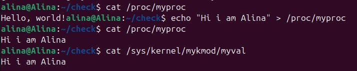
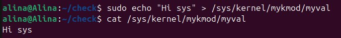

###  Отчёт модулям ядра Linux

#### 1. Простой модуль «Hello, World»

Первым заданием было познакомиться с базовым процессом разработки модуля ядра. Я создала файл `hello.c`, в котором определены  функции:
- **`init_module`** — выполняется при загрузке модуля и выводит в лог сообщение о том, что модуль успешно загружен.
- **`cleanup_module`**  — вызывается при удалении модуля и информирует о его выгрузке.

Такой минимальный модуль позволяет убедиться, что системный лог, механизмы загрузки и выгрузки работают корректно.

#### Компиляция
Для сборки модуля был использован простой Makefile:
```make
obj-m += hello.o

KDIR := /lib/modules/$(shell uname -r)/build
PWD  := $(shell pwd)

all:
	make -C $(KDIR) M=$(PWD) modules

clean:
	make -C $(KDIR) M=$(PWD) clean
```

Далее необходимо установить модуль в нашу систему с помощью последовательности команд:
```bash
make
sudo insmod hello.ko
# если никаких ошибок, то значит все хорошо установилось

lsmod | hello
dmesg | tail -n10
# последним должно быть сообщение о том, что наш модуль установлен

sudo rmmod hello # для удаления модуля из системы
dmesg | tail -n10
# последним должно быть сообщение о том, что наш модуль удален
```




#### 2. Символьное устройство через `/dev`

Во втором этапе модуль расширился функциональностью символьного устройства. Это позволило организовать обмен данными между пользовательским пространством и нашим кодом в ядре через файловый интерфейс.

Здесь такая же последовательность действий что и раньше, добавляется только создание файла устройства. При загрузке модуля, выводится с мажорным номером нового файла устройств, который мы должны создать, этот мажорный номер и будем писать в команду `mknod`:
```bash
make
sudo insmod hello.ko
# если никаких ошибок, то значит все хорошо установилось
lsmod | hello
dmesg | tail -n10
# последним должно быть сообщение о том, что наш модуль установлен и мажорный номер
mknod test c 240 0
#создание файла устройств
sudo rmmod hello # для удаления модуля из системы
dmesg | tail -n10
# последним должно быть сообщение о том, что наш модуль удален
```
В итоге у нас формируется файл `test`, в который мы можем записывать информацию и читать ее.




Итоговый код модуля ядра представлен в файле `test.c`
#### 3. Взаимодействие с `/proc` и `/sys`

Третий этап стал самым интересным: модуль научился работать с виртуальными файловыми системами.

Дальше необходимо было модифицировать модуль и написать его так, чтобы он мог работать с такими файловыми системами как sys и proc.

Итоговый код модуля ядра для чтения и записи с файловыми системами sys, proc представлен в файле `Module.c`

Для компиляции модуля использовался такой же Makefile, что и в прошлом примере. Установке ядра модуля происходила ровно с такой же последовательностью команд, что и ранее.



