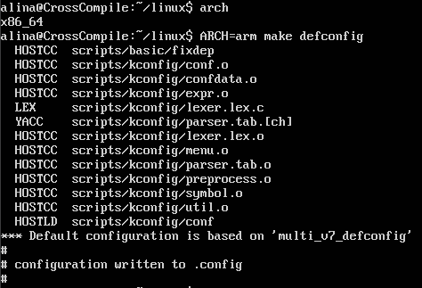
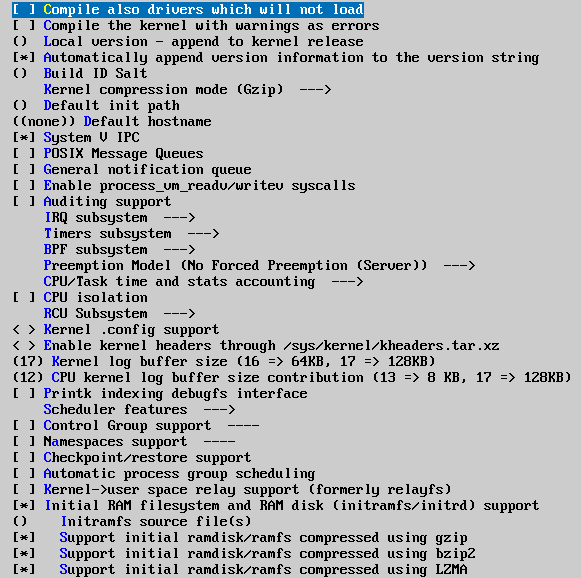
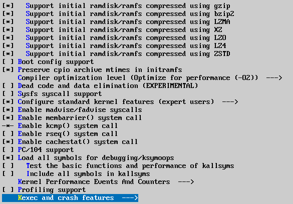
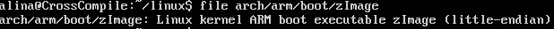
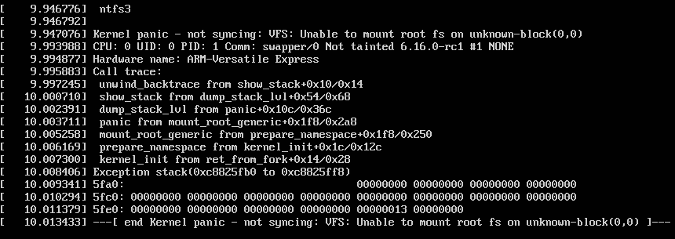

#### Шаг 1: Установка необходимых пакетов

Для сборки ядра и работы эмулятора qemu были установлены следующие пакеты:

```bash
sudo apt update
sudo apt install build-essential libncurses-dev bison flex
sudo apt install libssl-dev bc libelf-dev git
sudo apt install qemu-system-arm
```

#### Шаг 2: Клонирование репозитория ядра

Для получения исходный кода ядра, был загружен официальный репозиторий стабильных версий ядер для Linux:

```bash
git clone https://git.kernel.org/pub/scm/linux/kernel/git/stable/linux.git
cd linux
```

#### Шаг 3: Конфигурирование ядра

Чтобы настроить ядро для архитектуры, отличающейся от той, на которой запускается команда, необходимо напрямую указать для какой архитектуры должно производится сборка:
```bash
ARCH=arm make defconfig
```

Данная команда сгенерировала конфигурационный файл `.config` на основе шаблона `multi_v7_defconfig`, который поддерживает необходимую нам плату vexpress-a9.



Далее были изменены параметры дефолтной конфигурации в разделе **General Setup**. Отключены опции **Enable process vm/read/write syscalls** и **CPU Isolation**, так как они не требовались для минимальной сборки и могли бы добавить избыточный функционал.

**General Setup**:
  


Остальные параметры конфигурации остались без изменений.

#### Шаг 4: Установка кросс-компилятора

Для компиляции ядра под ARM был установлен кросс-компилятор:

```bash
sudo apt install gcc-arm-linux-gnueabihf
```

Этот пакет позволяет собирать ядро для архитектуры ARM в системе с иной архитектурой.

#### Шаг 5: Сборка ядра

Сборка ядра выполнена с использованием указания архитектуры и кросс-компилятора:

```bash
ARCH=arm CROSS_COMPILE=arm-linux-gnueabihf- make -j 16 zImage
```

- Параметр `-j 16` задает использование 16 потоков для ускорения процесса.
- Цель `zImage` указывает на создание сжатого образа ядра.

После сборки тип файла был проверен с помощью утилиты `file`:


Результат команды говорит нам о том, что полученный файл является ядром Linux для ARM.

#### Шаг 6: Сборка дерева устройств

Для работы с платой vexpress-a9 было собрано дерево устройств, которое необходимо для того, чтобы qemu понимал какие устройства должны быть подключены к эмулируемому устройству :

```bash
ARCH=arm make -j 16 dtbs
```

Команда скомпилировала dtb-файлы для всех поддерживаемых плат. Для запуска в QEMU был выбран файл `vexpress-v2p-ca9.dtb`, соответствующий нашей плате.

#### Шаг 7: Запуск эмулятора QEMU

Ядро было запущено в эмуляторе QEMU с использованием следующей команды:

```bash
QEMU_AUDIO_DRV=none qemu-system-arm -M vexpress-a9 -kernel zImage -dtb vexpress-v2p-ca9.dtb -nographic -append "console=ttyAMA0"
```

- `QEMU_AUDIO_DRV=none` отключение звука, так как он не требуется.
- `-M vexpress-a9` модель эмулируемой платы.
- `-kernel zImage` путь к собранному ядру.
- `-dtb vexpress-v2p-ca9.dtb` файл дерева устройств.
- `-nographic` не используем графику ncurses, перенаправляем вывод в терминал.
- `-append "console=ttyAMA0"` определяет консоль для вывода сообщений ядра, если не перенаправить вывод, то сообщений вообще не было бы видно.

В процессе запуска была получена ошибка **Kernel Panic**, вызванная отсутствием корневой файловой системы:



Это поведение является ожидаемым, так как ядро не получило корневую файловую систему, необходимую для полной загрузки.